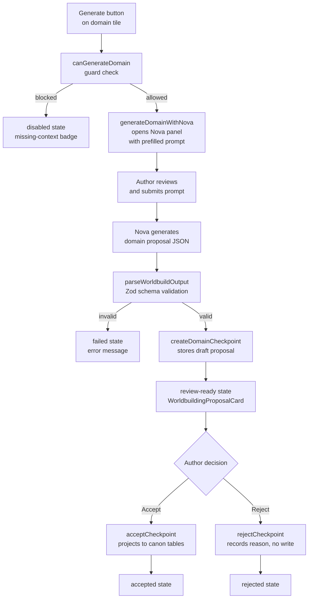

# Worldbuilding Domain Generation

Developer reference for the worldbuilding domain generation pipeline introduced in plan-034 stage-003.

## Architecture Overview



## Domain Taxonomy

| Domain | `id` | `targetEntities` | `dependencyIds` | `promptSeedKey` |
|--------|------|------------------|-----------------|-----------------|
| Personae | `personae` | characters, factions, lineages | _(none)_ | `worldbuilding.generate.personae` |
| Atlas | `atlas` | locations | personae | `worldbuilding.generate.atlas` |
| The Archive | `archive` | lore_entries, themes, glossary_terms | atlas | `worldbuilding.generate.archive` |
| Threads | `threads` | plot_threads | personae, atlas | `worldbuilding.generate.threads` |
| Chronicles | `chronicles` | timeline_events | personae, atlas, archive, threads | `worldbuilding.generate.chronicles` |

Source of truth: `src/modules/world-building/worldbuilding-workflow.ts`

## Pipeline Key Registry

Domain tasks live in the `vibe-worldbuild-domain` family, separate from the core 4-stage `vibe-worldbuild` pipeline:

| Task Key | Output Format | Zod Schema |
|----------|---------------|------------|
| `vibe-worldbuild.domain.personae` | `json_worldbuild_domain_personae` | `worldbuildDomainPersonaeSchema` |
| `vibe-worldbuild.domain.atlas` | `json_worldbuild_domain_atlas` | `worldbuildDomainAtlasSchema` |
| `vibe-worldbuild.domain.archive` | `json_worldbuild_domain_archive` | `worldbuildDomainArchiveSchema` |
| `vibe-worldbuild.domain.threads` | `json_worldbuild_domain_threads` | `worldbuildDomainThreadsSchema` |
| `vibe-worldbuild.domain.chronicles` | `json_worldbuild_domain_chronicles` | `worldbuildDomainChroniclesSchema` |

All 5 domain schemas use `.strict()` — extra fields from the model are rejected.

## State Machine

Each domain independently tracks an 8-state lifecycle:

```
idle ──────────────────────────────────────────────────────► missing-context
  │                                                                │
  ▼                                                                ▼
queued ◄────────────────────────────────── missing-context ──────►queued
  │
  ▼
running ──► review-ready ──► accepted ──► idle
  │              │
  ▼              ▼
failed        rejected ──► idle
  │
  ▼
idle / queued (retry)
```

Legal transitions are enforced in `worldbuilding-generation-state.svelte.ts`. Illegal transitions throw a descriptive error.

## How to Add a New Domain

1. **`worldbuilding-workflow.ts`**: Add a new entry to `WORLDBUILDING_DOMAIN_SEQUENCE` with `id`, `label`, `sequenceNumber`, `dependencyIds`, `targetEntities`, `generationReadiness`, `entryPath`, and `promptSeedKey`.

2. **`worldbuilding-workflow.ts`**: Add the new id to `WorldbuildingDomainId` union type.

3. **`task-catalog.ts`**: Add a new key to `PIPELINE_TASK_KEYS` (e.g. `WORLDBUILD_DOMAIN_RELICS`), add its definition to `PIPELINE_TASK_CATALOG` with `family: 'vibe-worldbuild-domain'`, and add it to `WORLDBUILD_DOMAIN_PIPELINE_KEYS`.

4. **`worldbuild-schemas.ts`**: Define a `.strict()` Zod schema for the new output format. Add it to `WORLDBUILD_SCHEMA_BY_OUTPUT_FORMAT`.

5. **`worldbuild-agent.ts`**: Add a payload interface (e.g. `WorldbuildDomainRelicsPayload`) and add it to `WorldbuildPayloadByTaskKey`.

6. **`prompt-library-seeds.ts`**: Add a PROMPT_SEEDS entry with the new `promptSeedKey`.

7. **`constants.ts`**: Add an `OUTPUT_FORMAT_DESCRIPTIONS` entry for the new output format key.

8. **`worldbuilding-readiness.ts`**: Update `DOMAIN_DEPS` if the new domain has upstream dependencies.

9. **Tests**: Add schema validation tests in `tests/world-building/worldbuild-generation.test.ts` and state machine coverage for the new domain id.

## How Prompt Seeds Map to Nova

`worldbuilding-generate-actions.ts` calls `openNovaForDomain(projectId, domainId)`, which:
1. Looks up the domain config from `WORLDBUILDING_DOMAIN_SEQUENCE`
2. Reads `config.promptSeedKey` and fetches from `PROMPT_SEEDS`
3. Builds a prefill string: `${seed.task}\n\n(Domain: ${config.label})`
4. Calls `novaMode.loadForProject(projectId)`, `novaMode.setMode('write')`, `novaPanel.openWithPrompt(prompt)`

Nova presents the prefill to the author, who can edit before submitting. The generated JSON is then parsed and stored as a draft checkpoint.

## How Accept Triggers Canon Projection

When `acceptCheckpoint(projectId, ownerId, proposalId)` is called (via the POST `/api/worldbuilding/proposals/[proposalId]/accept` endpoint):

1. The checkpoint service loads the stored `WorldbuildCheckpointRecord`
2. `hasPopulatedBibleProjection(record)` checks if the artifact contains `tableWrites`
3. For world-bible proposals, it atomically inserts rows into `characters`, `locations`, `factions`, `themes`, `glossary_terms`, `lore_entries`, `plot_threads`, `timeline_events`
4. Sets `acceptance.projectedToCanon = true` and `acceptance.entityCounts`
5. Updates the checkpoint lifecycle to `accepted`

Domain proposals (`vibe-worldbuild-domain` family) use `createDomainCheckpoint` but currently store directly to the `project_metadata` table. Their accept/reject flows route through the same `WorldbuildCheckpointService` endpoints.

## Troubleshooting

### Schema validation failure

**Symptom**: `parseWorldbuildOutput` returns `{ ok: false, error: { code: 'schema_validation_failed' } }`.

**Cause**: The model's JSON output doesn't conform to the registered Zod schema for the domain.

**Fix**: Check `error.details` for the specific field that failed. Domain schemas are `.strict()` — extra fields are rejected. Common issues: missing required `name`/`title`/`term` fields; sending a single object instead of an array; extra fields from the model's creative output.

### Missing-context state

**Symptom**: A domain tile shows "Missing required context" and the Generate button is disabled.

**Cause**: `evaluateReadiness()` detected that an upstream dependency domain has zero records.

**Fix**: Generate and accept at least one entity in the dependency domains first (follow the recommended sequence: Personae → Atlas → Archive → Threads → Chronicles).

### Canon projection atomicity failure

**Symptom**: `acceptCheckpoint` throws or records `projectedToCanon: false`.

**Cause**: A database constraint violation during the atomic insert (e.g. duplicate unique key, foreign key constraint).

**Fix**: Check the server logs for the SQLite error. The checkpoint remains `accepted` but with `projectedToCanon: false`. Re-running accept is blocked by the lifecycle guard. To retry, use the dev tools to reset the checkpoint to `draft` state, fix the conflicting data, and re-accept.
