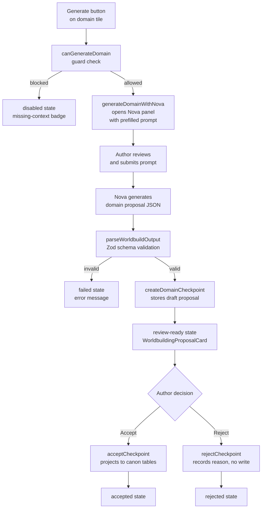

# Worldbuilding Domain Generation

Developer reference for the worldbuilding domain generation pipeline introduced in plan-034 stage-003.

## Architecture Overview



## Domain Taxonomy

| Domain | `id` | `targetEntities` | `dependencyIds` | `promptSeedKey` |
|--------|------|------------------|-----------------|-----------------|
| Personae | `personae` | characters, factions, lineages | _(none)_ | `worldbuilding.generate.personae` |
| Atlas | `atlas` | locations | personae | `worldbuilding.generate.atlas` |
| The Archive | `archive` | lore_entries, themes, glossary_terms | atlas | `worldbuilding.generate.archive` |
| Threads | `threads` | plot_threads | personae, atlas | `worldbuilding.generate.threads` |
| Chronicles | `chronicles` | timeline_events | personae, atlas, archive, threads | `worldbuilding.generate.chronicles` |

Source of truth: `src/modules/world-building/worldbuilding-workflow.ts`

## Pipeline Key Registry

Domain tasks live in the `vibe-worldbuild-domain` family, separate from the core 4-stage `vibe-worldbuild` pipeline:

| Task Key | Output Format | Zod Schema |
|----------|---------------|------------|
| `vibe-worldbuild.domain.personae` | `json_worldbuild_domain_personae` | `worldbuildDomainPersonaeSchema` |
| `vibe-worldbuild.domain.atlas` | `json_worldbuild_domain_atlas` | `worldbuildDomainAtlasSchema` |
| `vibe-worldbuild.domain.archive` | `json_worldbuild_domain_archive` | `worldbuildDomainArchiveSchema` |
| `vibe-worldbuild.domain.threads` | `json_worldbuild_domain_threads` | `worldbuildDomainThreadsSchema` |
| `vibe-worldbuild.domain.chronicles` | `json_worldbuild_domain_chronicles` | `worldbuildDomainChroniclesSchema` |

All 5 domain schemas use `.strict()` — extra fields from the model are rejected.

## State Machine

Each domain independently tracks an 8-state lifecycle:

```
idle ──────────────────────────────────────────────────────► missing-context
  │                                                                │
  ▼                                                                ▼
queued ◄────────────────────────────────── missing-context ──────►queued
  │
  ▼
running ──► review-ready ──► accepted ──► idle
  │              │
  ▼              ▼
failed        rejected ──► idle
  │
  ▼
idle / queued (retry)
```

Legal transitions are enforced in `worldbuilding-generation-state.svelte.ts`. Illegal transitions throw a descriptive error.

## How to Add a New Domain

1. **`worldbuilding-workflow.ts`**: Add a new entry to `WORLDBUILDING_DOMAIN_SEQUENCE` with `id`, `label`, `sequenceNumber`, `dependencyIds`, `targetEntities`, `generationReadiness`, `entryPath`, and `promptSeedKey`.

2. **`worldbuilding-workflow.ts`**: Add the new id to `WorldbuildingDomainId` union type.

3. **`task-catalog.ts`**: Add a new key to `PIPELINE_TASK_KEYS` (e.g. `WORLDBUILD_DOMAIN_RELICS`), add its definition to `PIPELINE_TASK_CATALOG` with `family: 'vibe-worldbuild-domain'`, and add it to `WORLDBUILD_DOMAIN_PIPELINE_KEYS`.

4. **`worldbuild-schemas.ts`**: Define a `.strict()` Zod schema for the new output format. Add it to `WORLDBUILD_SCHEMA_BY_OUTPUT_FORMAT`.

5. **`worldbuild-agent.ts`**: Add a payload interface (e.g. `WorldbuildDomainRelicsPayload`) and add it to `WorldbuildPayloadByTaskKey`.

6. **`prompt-library-seeds.ts`**: Add a PROMPT_SEEDS entry with the new `promptSeedKey`.

7. **`constants.ts`**: Add an `OUTPUT_FORMAT_DESCRIPTIONS` entry for the new output format key.

8. **`worldbuilding-readiness.ts`**: Update `DOMAIN_DEPS` if the new domain has upstream dependencies.

9. **Tests**: Add schema validation tests in `tests/world-building/worldbuild-generation.test.ts` and state machine coverage for the new domain id.

## How Prompt Seeds Map to Nova

`worldbuilding-generate-actions.ts` calls `openNovaForDomain(projectId, domainId)`, which:
1. Looks up the domain config from `WORLDBUILDING_DOMAIN_SEQUENCE`
2. Reads `config.promptSeedKey` and fetches from `PROMPT_SEEDS`
3. Builds a prefill string: `${seed.task}\n\n(Domain: ${config.label})`
4. Calls `novaMode.loadForProject(projectId)`, `novaMode.setMode('write')`, `novaPanel.openWithPrompt(prompt)`

Nova presents the prefill to the author, who can edit before submitting. The generated JSON is then parsed and stored as a draft checkpoint.

## How Accept Triggers Canon Projection

When a staged worldbuild checkpoint is accepted through
`PUT /api/db/project-metadata/{projectId}/pipeline/vibe-worldbuild/{checkpointId}`
with `operation: "accept"`:

1. The checkpoint service loads the stored `WorldbuildCheckpointRecord`
2. `hasPopulatedBibleProjection(record)` checks if the artifact contains `tableWrites`
3. For world-bible proposals, it atomically inserts rows into `characters`, `locations`, `factions`, `themes`, `glossary_terms`, `lore_entries`, `plot_threads`, `timeline_events`
4. Sets `acceptance.projectedToCanon = true` and `acceptance.entityCounts`
5. Updates the checkpoint lifecycle to `accepted`

Domain proposals (`vibe-worldbuild-domain` family) use `createDomainCheckpoint` and route through the same `WorldbuildCheckpointService` endpoints.

## Agentic Scan Proposal Flow

`POST /api/worldbuilding/scan` executes a scoped worldbuilding scan for one domain at a time. The route accepts the `WorldbuildScanRequest` envelope, validates that only allowed project context fields are present, calls the active AI provider (or `NOVELLUM_AI_MOCK=1` in tests/dev), normalizes model output into `WorldbuildProposalRecord` objects, suppresses exact duplicates against existing canon and pending proposals, then stores the surviving records under `project_metadata` with owner `vibe-worldbuild-scan`.

Scan proposals always start as `pending_review`. They never write to canon during scan execution.

When `POST /api/worldbuilding/proposals/[proposalId]/accept` receives a scan
proposal with `{ projectId }` in the request body, it delegates to
`acceptProposalAtomically(projectId, proposalId)`. That helper wraps the canon
insert and proposal status update in one SQLite transaction:

1. Load the `pending_review` proposal from `project_metadata`.
2. Insert the payload into the mapped canon table (`characters`, `locations`, `lore_entries`, `plot_threads`, or `timeline_events`).
3. Update the proposal to `accepted` with `acceptance.projectedToCanon = true`.
4. Roll the full transaction back if validation or insertion fails, leaving the proposal `pending_review`.

Rejecting a scan proposal uses the matching proposal reject route with
`{ projectId, reason }`, records `rejection` audit metadata, and performs no
canon write.

## Quick-Generate Context-Priority Flow

A lighter-weight generation path under `POST /api/worldbuilding/generate` lets authors
generate individual entity drafts (character, faction, lineage, realm, landmark, lore-entry,
plot-thread, timeline-event) without going through the full Nova/checkpoint domain pipeline.
This was introduced in plan-032 and extended in plan-036 to support context-priority hints.

### Request shape

```ts
{
  projectId: string;
  entityKind: EntityKind;
  count: 1 | 3 | 5;
  // Optional: typed context with intent hints
  generationContext?: {
    note?: string;
    hints?: Array<{
      name: string;
      intent: 'target' | 'avoid' | 'neutral';
      source: 'title' | 'synopsis' | 'manual' | 'legacy';
    }>;
  };
  // Legacy: plain free-text context string (still accepted)
  context?: string;
}
```

### Context-priority flow

1. **Pre-generation dialog** (`PreGenerationDialog.svelte`) — for character, faction, and lineage
   entity kinds, clicking the Generate button opens a dialog before dispatching the request.
   The dialog fetches the project's title/synopsis and runs `extractNameCandidates()` to surface
   candidate proper nouns. Authors can set each candidate's intent to `target` (prioritize) or
   `avoid` (deprioritize). Manual name entry is also available.

2. **Candidate extraction** (`extractNameCandidates` in `services/generation-context.ts`) —
   a deterministic, pure function that splits the combined title+synopsis into sentences, then
   collects capitalized non-sentence-initial words that are not stopwords. Returns up to 12 unique
   candidates.

3. **Server-side prompt injection** — `buildSystemPrompt` adds RULES lines for target/avoid hints:
   - `target` hints → "Treat these entities as preferred anchors when relevant"
   - `avoid` hints → "Do not make these entities the primary generated outputs"
   - Both → "If a target name already exists in canon, elaborate with a distinct variant"

4. **Draft validation** (`validateGeneratedDrafts` in `lib/ai/validators/worldbuilding-draft-validator.ts`) —
   after JSON extraction, each draft is validated and normalized for its entity kind:
   - Missing the required identity field (`name`/`title`) → draft dropped
   - Optional fields absent → filled with safe defaults (`''` or `[]`)
   - Mixed arrays retain valid drafts; all-invalid arrays return `validation_failed` error

5. **Save path** (`GeneratedEntityModal.saveDraft`) — character saves persist all expanded
   dossier fields: `coreDesire`, `fear`, `contradiction`, `strength`, `flaw`, `storyRole`,
   `externalGoal`, `internalNeed`, `stakes`, `voiceSummary`, `speechPattern`.

### Extending dialog kinds

`DIALOG_ENTITY_KINDS` in `GenerateButton.svelte` controls which entity kinds open the
pre-generation dialog. Currently: `character`, `faction`, `lineage`. Add new kinds there to
enable the dialog for them.

### Adding expanded fields to a new entity kind

1. Add the field to the entity's draft interface in `worldbuild-agent.ts`.
2. Update `ENTITY_SCHEMA` in the generate server to include the new field.
3. Update `normalizeByKind` in the validator to include/default the field.
4. Update `saveDraft` in `GeneratedEntityModal.svelte` to include the field in the POST body.

## Troubleshooting

### Schema validation failure

**Symptom**: `parseWorldbuildOutput` returns `{ ok: false, error: { code: 'schema_validation_failed' } }`.

**Cause**: The model's JSON output doesn't conform to the registered Zod schema for the domain.

**Fix**: Check `error.details` for the specific field that failed. Domain schemas are `.strict()` — extra fields are rejected. Common issues: missing required `name`/`title`/`term` fields; sending a single object instead of an array; extra fields from the model's creative output.

### Missing-context state

**Symptom**: A domain tile shows "Missing required context" and the Generate button is disabled.

**Cause**: `evaluateReadiness()` detected that an upstream dependency domain has zero records.

**Fix**: Generate and accept at least one entity in the dependency domains first (follow the recommended sequence: Personae → Atlas → Archive → Threads → Chronicles).

### Canon projection atomicity failure

**Symptom**: `acceptCheckpoint` throws or records `projectedToCanon: false`.

**Cause**: A database constraint violation during the atomic insert (e.g. duplicate unique key, foreign key constraint).

**Fix**: Check the server logs for the SQLite error. The checkpoint remains `accepted` but with `projectedToCanon: false`. Re-running accept is blocked by the lifecycle guard. To retry, use the dev tools to reset the checkpoint to `draft` state, fix the conflicting data, and re-accept.
