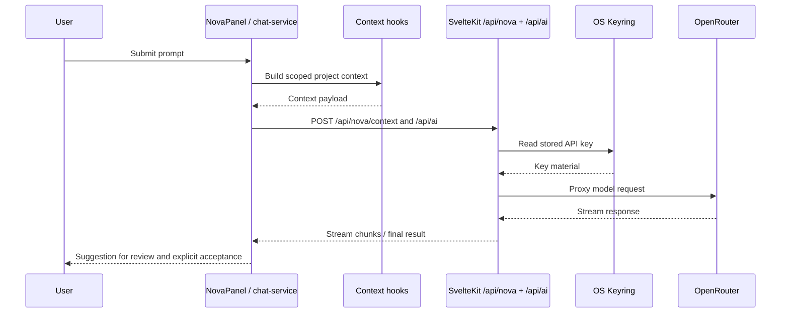

# Novellum Repository and Project Analysis

## Executive summary

Novellum is an early-stage but unusually well-structured desktop writing application for long-form fiction. The repository describes it as a **local-first, AI-assisted novel-writing workspace** built on **Svelte 5 + SvelteKit 2**, packaged as a **Tauri 2** desktop shell, backed by a single **SQLite** database, and using **OpenRouter** for bring-your-own-key AI features. Its core product thesis is coherent: authors keep data on-device, AI is optional and explicitly user-invoked, and feature logic is organized into domain modules rather than a monolithic app layer. fileciteturn36file0L3-L3 fileciteturn41file0L3-L3 fileciteturn57file0L3-L3

From a software-engineering standpoint, the strongest part of the repo is the architectural intent. The project has a documented **vertical-slice / feature-sliced** structure, public barrel exports, thin routes, server-only boundaries, token-driven styling, and a clear “author-in-the-loop” AI policy. The build surface is also relatively mature for a `0.0.1` target: CI runs check/lint/tests/build, release automation exists for macOS/Windows/Linux, visual regressions are scheduled, and Vitest coverage thresholds are defined. fileciteturn59file0L3-L3 fileciteturn31file0L3-L3 fileciteturn32file0L3-L3 fileciteturn33file0L3-L3 fileciteturn34file0L3-L3

The main risks are not “missing architecture,” but **execution drift**. There are meaningful mismatches between docs and code: architecture docs still talk about a smaller schema than the current `schema.ts`; the data-model doc describes fields and types that no longer match the canonical SQL; developer setup says Node 20+ while CI is pinned to Node 22; and at least one module barrel appears to import across a sibling module boundary in a way that conflicts with the documented boundary rules. There is also a packaging risk in the release pipeline: the release workflow builds Tauri artifacts directly, while the sidecar Node runtime is prepared by a separate script that is not obviously invoked in that workflow path. fileciteturn58file0L3-L3 fileciteturn52file0L3-L3 fileciteturn53file0L3-L3 fileciteturn37file0L3-L3 fileciteturn31file0L3-L3 fileciteturn32file0L3-L3 fileciteturn43file0L3-L3 fileciteturn59file0L3-L3 fileciteturn69file0L3-L3

Operationally, the project looks **actively maintained as of late May 2026**, with visible work on CI hardening, Nova UX/test stability, architecture refactoring, and dependency maintenance. The contributor footprint, however, appears concentrated around one primary maintainer, with support from automation such as Dependabot and coding-agent-generated PRs. That means the repo has a **good technical direction but a high bus-factor risk**. fileciteturn68file0L3-L3 fileciteturn69file0L3-L3 fileciteturn70file0L3-L3 fileciteturn71file0L3-L3

## Repository inspection and project shape

The README positions Novellum as a writing workspace for serious fiction authors rather than a generic note app or chat wrapper. The feature set is broad but internally consistent: manuscript editing, structural outlining, world-building, a grounded AI copilot, continuity checks, reader mode, exports, and portable backups. It is explicitly **local-first**, private, and non-SaaS. Licensing is proprietary and the package metadata points to a custom `LICENSE` file instead of an OSS license identifier. fileciteturn36file0L3-L3 fileciteturn29file0L3-L3 fileciteturn30file0L3-L3

The high-level architecture is a **desktop shell around a local web app**. Tauri hosts a WebView, spawns a bundled Node sidecar, and points that sidecar at the SvelteKit server on loopback. The SvelteKit server serves both the UI and the `/api/*` surface, with SQLite as the persistence layer, the OS keyring for secrets, and OpenRouter for AI requests. That is a pragmatic architecture for a local-first desktop app: it preserves web-development ergonomics while keeping keys and database access off the client. fileciteturn57file0L3-L3 fileciteturn56file0L3-L3 fileciteturn60file0L3-L3

The repository also contains a useful “agent context” document that acts as a current repo map. Based on that file, README, and architecture docs, the major directories resolve into the following responsibilities. fileciteturn42file0L3-L3 fileciteturn36file0L3-L3

| Major path | Responsibility | Evidence |
|---|---|---|
| `src/` | Main SvelteKit application code: routes, modules, shared libraries, styles, and top-level app plumbing. | fileciteturn42file0L3-L3 |
| `src/lib/` | Shared primitives: AI scaffolding, API client, server DB layer, platform helpers, settings primitives, shared components. | fileciteturn42file0L3-L3 |
| `src/modules/` | Vertical feature slices such as `editor`, `outline`, `project`, `nova`, `continuity`, `reader`, `export`, `world-building`. Public access is supposed to flow through each module’s `index.ts` barrel. | fileciteturn42file0L3-L3 fileciteturn59file0L3-L3 |
| `src/routes/` | Thin SvelteKit routes and API endpoints. Route names mirror product surfaces. | fileciteturn42file0L3-L3 fileciteturn61file0L3-L3 |
| `src/lib/server/db/` | Canonical SQLite schema, path resolution, migrations, DB singleton, serialization helpers. | fileciteturn60file0L3-L3 fileciteturn52file0L3-L3 fileciteturn54file0L3-L3 fileciteturn55file0L3-L3 |
| `src-tauri/` | Rust desktop shell, sidecar lifecycle, Tauri config, capabilities, bundled Node binaries. | fileciteturn56file0L3-L3 fileciteturn30file0L3-L3 |
| `tests/` | Unit, e2e, visual, DB, and module-mirrored tests. | fileciteturn42file0L3-L3 fileciteturn35file0L3-L3 |
| `dev-docs/` | Internal engineering reference: project vision, architecture, AI pipeline, module references, plans, audits, workflow docs. | fileciteturn42file0L3-L3 |
| `novellum-docs/` | User-facing and contributor-facing product documentation. | fileciteturn36file0L3-L3 fileciteturn37file0L3-L3 fileciteturn38file0L3-L3 |
| `scripts/` | Build, packaging, version-sync, changelog, sidecar-fetch, and smoke-test scripts. | fileciteturn42file0L3-L3 fileciteturn29file0L3-L3 |

A notable analytical point: the docs repeatedly cite the architecture as disciplined and barrel-governed, but the codebase is already large enough that **documentation freshness matters as much as documentation existence**. In Novellum, `schema.ts` is the true source of truth when docs disagree. That is especially important here because several architecture docs are already stale in small but meaningful ways. fileciteturn52file0L3-L3 fileciteturn53file0L3-L3 fileciteturn58file0L3-L3

## Code architecture and public APIs

The main implementation languages are **TypeScript/Svelte**, **JavaScript for scripts/config**, **Rust for the Tauri shell**, and **SQL embedded in TypeScript**. The primary frameworks and libraries are Svelte 5, SvelteKit 2, Vite 8, Tauri 2, better-sqlite3, TipTap 3, Zod, Playwright, Vitest, Storybook, and OpenRouter via an internal HTTP client. Dexie is retained only for backup/restore portability, not live persistence. fileciteturn29file0L3-L3 fileciteturn30file0L3-L3 fileciteturn41file0L3-L3

Architecturally, the repo combines several recognizable patterns:

- **Vertical Slice Architecture / Feature-Sliced Design influence**, documented explicitly.  
- **Repository/service pattern** for domain CRUD and orchestration functions.  
- **Thin-route / fat-service split** in SvelteKit.  
- **Public barrel exports** as the module boundary contract.  
- **Server-only boundary** for secrets and persistence.  
- **Local-first desktop sidecar architecture** via Tauri + SvelteKit Node adapter.  
- **Author-in-the-loop AI flow**, where outputs are suggestions rather than direct mutations. fileciteturn59file0L3-L3 fileciteturn57file0L3-L3 fileciteturn60file0L3-L3 fileciteturn62file0L3-L3

The internal public API surface is split between **module barrels** and **HTTP endpoints**. Representative exports include `apiGet/apiPost/apiPut/apiDel` and `ApiError` in the shared client, domain CRUD functions in `project`, `editor`, and `outline`, Nova session/tooling/chat APIs in `nova`, continuity orchestration in `continuity`, and compile/export/portability APIs in `export`. That means the repo already behaves like a platform internally, even though it does not expose a third-party SDK externally. fileciteturn50file0L3-L3 fileciteturn44file0L3-L3 fileciteturn43file0L3-L3 fileciteturn45file0L3-L3 fileciteturn46file0L3-L3 fileciteturn47file0L3-L3 fileciteturn48file0L3-L3

The canonical data model lives in `src/lib/server/db/schema.ts`. It includes tables for projects, structural hierarchy, world-building, continuity findings, export settings, snapshots, prompts/instructions, app preferences, project metadata, and schema migrations. The docs still describe a smaller “16 shipped + auxiliary” model, but the live schema clearly contains a materially larger set, including `app_preferences`, `project_metadata`, and `schema_migrations`. The docs also drift on field naming and typing: for example, the data-model writeup references `projects.name` and integer timestamps, while the schema defines `projects.title` and many timestamp columns as `TEXT`. That drift is not catastrophic, but it is large enough to cause onboarding and maintenance friction. fileciteturn52file0L3-L3 fileciteturn53file0L3-L3 fileciteturn58file0L3-L3

There are also a few code-level tensions worth calling out. The architecture docs say modules must not cross-import sibling internals except through public barrels, but `src/modules/outline/index.ts` re-exports `arc-repository` directly from `$modules/project/services/arc-repository.js`, which looks like a direct sibling-internal dependency. Similarly, the AI docs describe a richer pipeline than the currently exported `Orchestrator` implementation appears to embody, suggesting either a compatibility shim, legacy code, or documentation that has run ahead of the actual orchestrator abstraction. fileciteturn43file0L3-L3 fileciteturn59file0L3-L3 fileciteturn62file0L3-L3 fileciteturn63file0L3-L3 fileciteturn65file0L3-L3

The graph below is a synthesis of the architecture docs, package manifests, and key module barrels. fileciteturn57file0L3-L3 fileciteturn29file0L3-L3 fileciteturn30file0L3-L3 fileciteturn45file0L3-L3

```mermaid
graph TD
    U[User]
    T[Tauri 2 Shell]
    W[WebView]
    N[Node Sidecar]
    SK[SvelteKit Server]
    R[Routes and Module UI]
    M[Feature Modules]
    AC[api-client.ts]
    DBAPI[/api/db/*]
    AIAPI[/api/ai and /api/nova/*]
    SETAPI[/api/settings/*]
    BAKAPI[/api/backup and /api/restore/*]
    DB[(SQLite via better-sqlite3)]
    KR[OS Keyring]
    OR[OpenRouter]

    U --> T
    T --> W
    T --> N
    N --> SK
    W --> R
    R --> M
    M --> AC
    AC --> DBAPI
    AC --> AIAPI
    AC --> SETAPI
    AC --> BAKAPI
    DBAPI --> DB
    SETAPI --> DB
    SETAPI --> KR
    AIAPI --> KR
    AIAPI --> OR
    BAKAPI --> DB
```

A typical **Nova chat** operation looks like this: the user prompts the Nova UI, the Nova module assembles scoped context, the client posts to server endpoints, the server retrieves the key from the OS keyring and proxies the request to OpenRouter, then the reply is streamed back for user review. That is aligned with the repo’s stated “scoped context” and “no silent edits” model. fileciteturn45file0L3-L3 fileciteturn60file0L3-L3 fileciteturn62file0L3-L3 fileciteturn40file0L3-L3



## Build, test, and deployment

A contributor can run Novellum either as a web app or as the packaged desktop shell. The developer docs state **Node.js 20+**, **pnpm 9+**, and **Rust 1.77.2+** as prerequisites, while CI and release workflows pin **Node 22**. In practice, that mismatch means a safe recommendation is to use Node 22 locally if you want parity with automation. The desktop shell targets macOS, Windows, and Linux. `better-sqlite3` requires native bindings, so a working C++ toolchain is also required during install. fileciteturn37file0L3-L3 fileciteturn31file0L3-L3 fileciteturn32file0L3-L3

The repo’s script surface is strong. It supports dev, build, preview, checks, linting, coverage, e2e, visual tests, Storybook, Tauri dev/build, version synchronization, Node-binary fetching, and built-server smoke tests. That is a healthier script inventory than many pre-1.0 applications, and it suggests the maintainer is already thinking in terms of production packaging rather than demo-only development. fileciteturn29file0L3-L3

A practical local workflow is straightforward:

1. Clone the repo and install dependencies with `pnpm install`.  
2. Run `pnpm dev` for the local web workflow.  
3. Run `pnpm desktop:dev` for the Tauri desktop workflow.  
4. Validate with `pnpm check`, `pnpm lint`, `pnpm lint:css`, `pnpm check:tokens`, and `pnpm test`.  
5. For UI-visible changes, also run `pnpm test:e2e` and `pnpm test:visual`. fileciteturn37file0L3-L3 fileciteturn38file0L3-L3

CI/CD is built around three main workflows. `ci.yml` runs on pushes and PRs to `master` and executes type-check, lint, unit tests, and a SvelteKit build plus smoke test. `visual-tests.yml` runs weekly and on manual dispatch. `release.yml` validates on tag pushes, then builds matrix Tauri packages for macOS, Windows, and Ubuntu, creating draft releases for version tags matching `vX.Y.Z`. User docs say distributable artifacts are `.dmg`, `.msi`, and `.AppImage`, which aligns with the Tauri release workflow. fileciteturn31file0L3-L3 fileciteturn33file0L3-L3 fileciteturn32file0L3-L3 fileciteturn39file0L3-L3

Testing is meaningfully layered. Unit tests run in Vitest with JSDOM and an 80% line threshold over selected service paths; Playwright covers e2e and visual baselines; Storybook is present for component-level development; and the repo includes a built-server smoke harness to catch packaging/runtime regressions that source-level tests would miss. That is a strong quality posture. The main caveat is that recent repo history also shows visual regression fragility around Nova, so the presence of tests should be interpreted as a serious engineering effort, not as proof that every test tier is fully stable yet. fileciteturn34file0L3-L3 fileciteturn35file0L3-L3 fileciteturn29file0L3-L3 fileciteturn70file0L3-L3

## Development activity and project health

The visible development pattern is one of **rapid hardening rather than dormant experimentation**. Four themes dominate the evidence: architecture refactoring, Nova/AI UX improvements, CI/release stabilization, and UI polish. PR 1 reworked the UI and Stories Hub; PR 2 unblocked the test suite, wired continuity checks, and added tracked CI/release/visual workflows; PR 4 refactored reader orchestration; PR 5 focused on a larger production-architecture refactor plus AI-integrated editor polish; PR 16 attempted to stabilize Nova visual regressions; and PR 20 shows active dependency maintenance via Dependabot. fileciteturn72file0L3-L3 fileciteturn69file0L3-L3 fileciteturn73file0L3-L3 fileciteturn68file0L3-L3 fileciteturn70file0L3-L3 fileciteturn71file0L3-L3

Contributor activity appears concentrated. The merged architectural and product-shaping PRs are associated with the `gibsondevhouse` account, while automation also plays a visible role through Copilot-authored and Dependabot PRs. That indicates two things at once: the project is active, and its continuity likely depends heavily on one primary maintainer. For a solo or near-solo project this is normal, but it lowers resilience for reviews, release management, and documentation freshness. fileciteturn68file0L3-L3 fileciteturn69file0L3-L3 fileciteturn70file0L3-L3 fileciteturn71file0L3-L3

Maintenance status is best described as **active pre-release hardening**. The version in both `package.json` and `Cargo.toml` is `0.0.1`, user installation docs tell users to download the latest GitHub release, and release automation is clearly being prepared, but the inspected evidence does not show a long release history. So the repo looks maintained, but still very much in the “shipping the first serious release” phase rather than a mature multi-release product cadence. fileciteturn29file0L3-L3 fileciteturn30file0L3-L3 fileciteturn39file0L3-L3 fileciteturn32file0L3-L3

My health assessment is therefore mixed but positive. The engineering posture is serious, the codebase has shape, and the repo shows recent visible movement. The negative side is the usual one for fast-moving pre-1.0 solo-maintained software: documentation drift, some testing instability, packaging-edge fragility, and limited visible process redundancy. fileciteturn37file0L3-L3 fileciteturn38file0L3-L3 fileciteturn68file0L3-L3 fileciteturn70file0L3-L3

## Security and licensing assessment

The security posture is reasonable for a local-first desktop app. The app keeps manuscript and metadata locally in SQLite, stores the OpenRouter key in the OS keyring instead of the database, excludes that key from backups, and routes AI requests through server endpoints so the browser never holds the credential. The privacy posture is explicit: there is no telemetry, and the only third-party data flow is user-triggered traffic to OpenRouter. fileciteturn40file0L3-L3 fileciteturn60file0L3-L3 fileciteturn76file0L3-L3 fileciteturn39file0L3-L3

The most security-relevant code surfaces are the **server endpoints**, the **database-path resolution and migration layer**, the **local file endpoints**, and the **AI proxy/key management path**. The absence of auth is acceptable under the documented “single-user loopback app” assumption, but it is an assumption that must stay true; if the loopback exposure model or embedded-server posture changes later, file/path normalization and server endpoints become a much higher-risk attack surface. fileciteturn60file0L3-L3 fileciteturn54file0L3-L3 fileciteturn55file0L3-L3

The strongest concrete risk I found is in packaging/release correctness. The release workflow performs checkout, install, sync, and then hands control directly to `tauri-action`. But the sidecar Node runtime is fetched by `scripts/fetch-node.mjs`, and the package scripts wire that through `predesktop:build`; the release workflow does not obviously invoke that path. A review comment on PR 2 explicitly flagged this as a P1 issue, warning that Tauri release jobs could reach bundling without the required sidecar binaries. That should be treated as a real release blocker until proven otherwise. fileciteturn32file0L3-L3 fileciteturn29file0L3-L3 fileciteturn69file0L3-L3

Licensing is internally consistent in broad terms but not fully polished. The product license is proprietary in the README and Cargo manifest, while `package.json` defers to the repository license file. `NOTICE.md` lists major MIT and Apache-licensed dependencies and is broadly compatible with a proprietary application, but it also includes a `LEGAL_REVIEW_REQUIRED` marker telling maintainers to verify the dependency/license inventory before publication. `PRIVACY.md` and `SECURITY.md` likewise include legal-review placeholders. So the licensing model is workable, but the compliance artifacts are not yet at “ship and forget” quality. fileciteturn36file0L3-L3 fileciteturn30file0L3-L3 fileciteturn29file0L3-L3 fileciteturn75file0L3-L3 fileciteturn76file0L3-L3 fileciteturn77file0L3-L3

I did not find repository-hosted evidence of a published vulnerability backlog or visible security advisory feed in the materials inspected. What I did find is a documented security policy with a reporting address and response window commitments, which is good, and enough operational evidence to say the project is thinking about shipping risk, not just source code. fileciteturn77file0L3-L3

## Recommended improvements and related research

The most useful near-term improvements are the ones that reduce shipping risk without forcing a rewrite.

| Area | Why it matters | Estimated effort | Suggested implementation |
|---|---|---|---|
| Release workflow sidecar fetch fix | Current release path may bypass `fetch-node`, risking broken desktop artifacts. | Medium | Add an explicit platform-aware sidecar fetch step in `release.yml`, then add an artifact smoke check that confirms sidecar presence before draft release publication. | 
| Documentation drift audit | Docs no longer fully match schema, field names, version requirements, or some AI abstractions. | Small to medium | Make `schema.ts`, route manifests, and package/runtime versions the canonical sources; add a doc verification checklist or generated doc fragments for schema and env requirements. |
| Boundary-rule enforcement cleanup | `outline/index.ts` appears to deep-import a sibling module internal despite the documented barrel rule. | Small | Move shared structural repository exports to the `project` barrel or a neutral shared layer, then eliminate cross-module deep imports. |
| Nova deterministic-idle and testability hardening | Recent PRs show visual/test fragility around Nova and onboarding state. | Medium | Add an explicit “stream idle” UI state, reduce animation variance under test, and expose test hooks in one sanctioned place rather than through distributed timing assumptions. |
| Compliance hardening | Legal docs and notices still contain review placeholders. | Small to medium | Generate an SBOM/license snapshot during release, finalize privacy/security/legal text, and publish exact third-party attributions with every release artifact. |

These recommendations are grounded directly in repo evidence. The first follows from the current packaging flow and PR review warning. The second and third follow from current doc/code drift and barrel-boundary tension. The fourth follows from the visible Nova visual-testing stabilization effort. The fifth follows from the state of `NOTICE.md`, `PRIVACY.md`, and `SECURITY.md`. fileciteturn32file0L3-L3 fileciteturn29file0L3-L3 fileciteturn69file0L3-L3 fileciteturn58file0L3-L3 fileciteturn52file0L3-L3 fileciteturn43file0L3-L3 fileciteturn59file0L3-L3 fileciteturn70file0L3-L3 fileciteturn75file0L3-L3 fileciteturn76file0L3-L3 fileciteturn77file0L3-L3

On outside comparison, Novellum overlaps most strongly with **Scrivener** and **Obsidian**, but with a different center of gravity. Scrivener emphasizes outliner-driven manuscript organization, templates, metadata, drag-and-drop restructuring, and writer-centric compilation workflows; that aligns closely with Novellum’s `project`, `outline`, and `export` ambitions. Obsidian, by contrast, emphasizes local file ownership, offline access, extensibility, graph/canvas thinking, and long-term portability; that is closer to Novellum’s local-first philosophy and its world-building knowledge surfaces. The implication is that Novellum should borrow **Scrivener’s workflow depth** and **Obsidian’s extensibility/portability instincts**, without becoming either product. citeturn9view1turn11view1

The project’s use of Tauri and OpenRouter is also directionally sensible. Tauri’s official site emphasizes cross-platform delivery, security, and small binaries while staying frontend-agnostic, which matches Novellum’s sidecar-based desktop strategy. OpenRouter’s docs expose model routing, tool calling, structured outputs, and privacy-related features, which fit Novellum’s BYOK, model-selection, and constrained-agent architecture. citeturn9view3turn9view2

For future product evolution, the most relevant outside research is not generic “AI in writing,” but work on **grounded generation**, **local-first correctness**, and **creative-writing interface design**. The original RAG paper is still directly relevant because it shows why retrieval-grounded generation tends to outperform parametric-only generation on specificity and factuality; that validates Novellum’s emphasis on project-grounded Nova context. Local-first research such as *Behavioural Types for Local-First Software* and the broader local-first ecosystem are especially important if Novellum ever adds multi-device sync or collaboration, because correctness and eventual consistency become much harder once the current single-device assumption is relaxed. citeturn10academia4turn10academia0turn9view0

The most product-specific paper I found is *PromptCanvas*, which reports that a widget-based, composable prompting workspace outperformed a traditional chat UI on creativity-support measures in creative-writing tasks. That is a strong signal that Nova should probably not remain “just a sidebar chat” forever. A more spatial or card-based prompting surface—especially for scene goals, continuity issues, rewrite options, and world-building context—could be materially better for authors than linear chat alone. A second recent paper on human-AI collaborative writing argues that coherence support and revision methodology become more important in the LLM era, which maps directly to Novellum’s continuity, snapshots, and author-acceptance workflow. citeturn10academia1turn10academia2

## Open questions and limitations

This report is strongest on **repository shape, architecture, build/test flow, and documented behavior**, because those were directly inspectable through the GitHub connector. It is weaker on **precise issue counts, full commit histograms, star/fork metrics, and release-history cadence**, because the available connector outputs exposed those unevenly during inspection.

A few source-of-truth conflicts remain unresolved. The main one is documentation freshness: when `dev-docs` and implementation disagree, `schema.ts`, `package.json`, workflow files, and module barrels should be trusted over prose docs until the docs are refreshed. fileciteturn52file0L3-L3 fileciteturn53file0L3-L3 fileciteturn29file0L3-L3 fileciteturn31file0L3-L3 fileciteturn32file0L3-L3

The bottom-line judgment is still high confidence: **Novellum is a serious, thoughtfully engineered local-first writing application with strong architectural bones, active maintenance, and clear product differentiation—but it needs packaging hardening, documentation reconciliation, and compliance polish before it can be considered fully release-ready.**