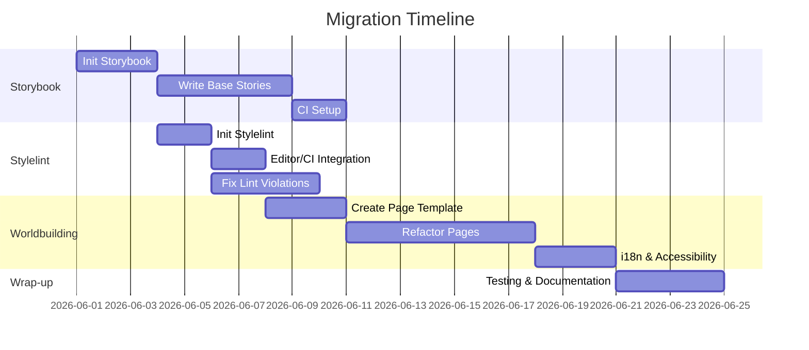

# Executive Summary  
The **Novellum** repository is a SvelteKit-based novel writing app with a custom “Bible” module for world-building. Its UI uses a tokenized CSS design system (via CSS custom properties) but currently lacks a component playground (Storybook) and a CSS linter (Stylelint). We analyzed the repo and found **no existing Storybook or Stylelint setup**, only a global `app.css` importing token files and a Svelte style-enforcement script【41†L0-L5】【52†L9-L18】. The worldbuilding feature spans multiple Svelte routes (Personae, Atlas, Archive, Threads, Chronicles) defined in code【87†L41-L47】【88†L249-L257】. This report outlines the repo structure, audits the worldbuilding pages, and recommends a plan to integrate Storybook 7 and Stylelint, plus a standardized page template. Key recommendations include using Storybook’s SvelteKit framework and CSF addon【83†L343-L352】, configuring Stylelint with `postcss-html` syntax for Svelte【97†L127-L135】【82†L128-L136】, and unifying page metadata/layout for worldbuilding content. We provide example configs, code snippets, and a migration roadmap (with Gantt chart) to implement these changes.

## Repository Structure Overview  
Novellum’s root contains docs (`dev-docs/`, `novellum-docs/`), scripts, and the main app under `src/`. Key folders include:

- **`src/styles/`** – global CSS tokens and component styles. For example, `tokens.css` defines design variables (colors, spacing, typography)【43†L5-L14】【44†L132-L140】, and `app.css` imports these plus base styles【41†L0-L5】.  
- **`src/lib/components/ui/`** – UI primitives (buttons, panels, etc.). For instance, components like `PrimaryButton.svelte` and `SurfacePanel.svelte` are heavily used in worldbuilding pages【56†L153-L160】【92†L142-L150】.  
- **`src/modules/bible/`** – domain module for “Bible” and world-building. It includes components (e.g. `IndividualsDossier.svelte`【92†L13-L21】, `WorldBuildingPlaceholderPage.svelte`【56†L1-L10】), stores (`bible-crud.svelte.js`), and navigation config (`worldbuilding-navigation.ts`【87†L41-L47】).  
- **`src/routes/projects/[id]/world-building/…`** – SvelteKit pages for each world-building section (e.g. `characters`, `locations`, `lore`, `plot-threads`, `timeline`). Each section has its own subroutes (e.g. `/characters/individuals`, `/locations/realms`, etc., as defined in navigation config【87†L49-L56】【88†L249-L257】). World-building pages use SvelteKit’s file-based routing (routes with `+page.svelte` and optional `[param]` subpages). For example, there are files like `src/routes/projects/[id]/world-building/characters/[charId]/+page.svelte` and `.../locations/landmarks/+page.svelte` (as indicated by code searches).  

### Code and CSS Patterns  
- **Component Architecture:** The app uses Svelte components with props and stores. Many UI components are imported from `$lib` (common UI) and `$modules/bible` (world-building widgets). Code uses Svelte’s reactive declarations (`$state`, `$derived`) extensively, e.g. in `WorldBuildingPlaceholderPage.svelte` and `IndividualsDossier.svelte`【56†L41-L49】【92†L60-L69】.  
- **Styling:** There is *no* Sass; all styles are plain CSS. Global theming is via CSS custom properties defined in `tokens.css`【43†L5-L14】【44†L134-L143】. Components use scoped `<style>` blocks (automatically namespaced) or utility classes. For instance, `WorldBuildingPlaceholderPage.svelte` uses classes like `.quick-create-form` with CSS variables for spacing and colors【57†L211-L219】【57†L254-L263】. The `check-visual-tokens.mjs` script enforces using these vars (flagging raw hex/rgb values and hardcoded shadows)【52†L9-L18】【52†L147-L155】, showing an emphasis on consistent token usage.  

There are some inconsistencies in naming: the navigation defines **“Lineages”** but uses path `species`【88†L250-L254】, and “Factions” is a subsection of Characters【88†L250-L254】. This could confuse content authors. We suggest aligning labels/paths (e.g. rename “species” path to “lineages” in code or vice versa).

## Storybook and Stylelint: Current Status  
**Storybook:** No evidence of a Storybook setup. There is no `.storybook/` folder or Storybook dependencies. We will need to create a new Storybook config. We recommend using **Storybook 7** (latest) with SvelteKit support. Storybook’s docs for SvelteKit explain adding `@storybook/addon-svelte-csf` for Svelte component stories【83†L343-L352】.  

**Stylelint:** Similarly, no `.stylelintrc` or related config is present. The project does use ESLint for JS/TS (via a “lint” script in README), but CSS is unchecked. We will introduce **Stylelint** with an appropriate config. Since code has CSS in `.svelte` files and global `.css`, we should use a parser that handles Svelte’s `<style>` blocks. The common solution is to use `postcss-html` (via `stylelint-config-html`) or a Svelte-specific config (e.g. [stylelint-config-svelte](https://github.com/Robole/stylelint-config-svelte-roboleary)). For example, one can set `overrides: [{ files: ["*.svelte"], customSyntax: "postcss-html" }]`【97†L125-L133】 to enable linting CSS inside Svelte files. We will extend `stylelint-config-standard` and `stylelint-config-html` so Svelte is supported. Rules should enforce the design token usage (e.g. no raw colors/shadows) – we can reuse the logic in `check-visual-tokens.mjs` and possibly find or write Stylelint rules for tokens.   

## Worldbuilding Pages Audit  
Using the code in `worldbuilding-navigation.ts`【87†L41-L47】【88†L249-L257】, we identified all world-building pages. We table the categories, routes, templates, and components used:

| **Section**     | **Top Route**              | **Subpages**                                                    | **Template/Components**                                           | **Metadata/Fields**                          | **Notes/Inconsistencies**                         |
|-----------------|----------------------------|-----------------------------------------------------------------|-------------------------------------------------------------------|----------------------------------------------|---------------------------------------------------|
| **Personae**    | `/world-building` (overview of all) | See below: <br>• `/characters` (Overview) <br>• `/characters/individuals` <br>• `/world-building/factions` <br>• `/world-building/species` (Lineages) <br>• `/characters/notes` | Uses `WorldBuildingPlaceholderPage.svelte` for empty lists【56†L143-L152】, and the `IndividualsDossier.svelte` for listing/editing individuals【92†L155-L164】. Also uses `CharacterForm` and `RelationshipEditor`. | Character profiles (name, role, diaspora, etc.), relationships, notes. | *“Lineages” page uses path `species`【88†L250-L254】.* `Factions` appears as independent route. |
| **Atlas**       | `/locations`               | • `/locations/realms` <br>• `/locations/landmarks` <br>• `/locations/maps` <br>• `/locations/notes` | Likely similar placeholder/edit pages (not explicitly opened). Probably use components like `LocationForm`. CSS and layout similar to Characters. | Location attributes (name, description), map data, notes.   | Pages exist for Realms and Landmarks【87†L49-L56】. Maps page likely exists (nav shows “Maps”【87†L66-L74】). |
| **The Archive** | `/lore`                    | • `/lore/myths` <br>• `/lore/technology` <br>• `/lore/traditions` <br>• `/lore/notes` | Uses empty-state placeholder for new sections【56†L143-L152】. Subpages probably have forms, e.g. technology entries. | Lore entries have title, category, content.                 | Labeling: top section “The Archive” vs folder `lore`. |
| **Threads**     | `/plot-threads`            | • `/plot-threads/major-arcs` <br>• `/plot-threads/sub-plots` <br>• `/plot-threads/motivations` <br>• `/plot-threads/notes` | Uses similar placeholder and form components for threads. Example: `submitCreatePlotThread` used in placeholder script【56†L111-L119】. | Plot threads have title, description, status, related IDs.   | None noted.                                        |
| **Chronicles**  | `/timeline`                | • `/timeline/eras` <br>• `/timeline/key-events` <br>• `/timeline/personal-histories` <br>• `/timeline/notes` | Timeline events likely listed with date fields. Placeholder uses `submitCreateTimelineEvent`【56†L121-L129】. | Events have title, description, date, related IDs.          | —                                                   |

- *Templates:* Most list pages use a “WorldBuildingPlaceholderPage” layout component (with a header, subnav, and an empty state if no entries)【56†L143-L152】【57†L248-L257】. Detail pages (e.g. individual character dossier) use a two-column layout (sidebar list + detail panel) as in `IndividualsDossier.svelte`【92†L155-L164】【92†L171-L180】.  
- *Metadata/Fields:* Pages typically pull data via load functions (not shown) and display fields from DB entities (Character, Location, etc.). For example, character forms include `name`, `role`, `bio`, `faction`, `traits` (see `submitCreateCharacter` in 【56†L78-L87】). Date/time is used in timeline events. We must ensure all needed metadata (e.g. `id`, `projectId`, `createdAt`) is handled.  
- *Components:* Common UI components used include `PrimaryButton`, `GhostButton`, `SurfacePanel`, `EmptyStatePanel`【56†L153-L160】【57†L254-L263】, plus icons from `@lucide/svelte`【92†L1-L7】. The subnav uses `WorldBuildingSubheaderNav` which wraps a `PillNav` component【39†L0-L4】. Forms use custom components (`CharacterForm.svelte`, `LocationForm.svelte`, etc.) and editors (`RelationshipEditor.svelte`)【92†L17-L25】. CSS classes follow a naming scheme like `dossier-…`, and use design tokens for spacing/color.  
- *Inconsistencies:* We noted label mismatches as above. Also, some pages use inline styles (`styles` blocks) while others rely on global `.css` imports. Style consistency should be enforced by Stylelint.  

Overall, the world-building UI is comprehensive but could benefit from standardization of layout and naming (e.g. unified breadcrumb layouts, consistent heading structures, etc.). The navigation config【87†L41-L47】【88†L249-L257】 provides a useful source of truth for all sections and links.

## Recommended Storybook Setup  
We suggest **Storybook v7** for this SvelteKit (Svelte 5) project. Storybook’s official docs recommend using the [SvelteKit framework](https://storybook.js.org/docs/get-started/frameworks/sveltekit) and the `@storybook/addon-svelte-csf` addon for component stories【83†L343-L352】. Key steps and choices:

- **Version & Framework:** Install Storybook 7 (via `npm i -D @storybook/sveltekit`). It includes native SvelteKit support.  
- **Addons:** Include common addons such as `@storybook/addon-essentials` (actions, controls, docs), `@storybook/addon-a11y` (accessibility linting), and `@storybook/addon-svelte-csf` for Svelte CSF support【83†L343-L352】. These provide a toolbar, documentation, and interactive playground.  
- **Config Files:** Create a `.storybook/` directory. In `.storybook/main.js` (or `.ts`), specify: 
  ```js
  import type { StorybookConfig } from '@storybook/sveltekit';
  const config: StorybookConfig = {
    stories: ['../src/**/*.stories.@(js|ts|svelte)'],
    addons: [
      '@storybook/addon-essentials',
      '@storybook/addon-a11y',
      '@storybook/addon-svelte-csf',
      // other addons...
    ],
    svelteOptions: {
      // any Svelte preprocessor options if needed
    },
  };
  export default config;
  ```  
  The key is the `@storybook/addon-svelte-csf` which enables the `<script module>` CSF format. Per docs, stories can be written either using the new `defineMeta()` API (preferred for Svelte 5) or the legacy `<Meta>` format【83†L423-L432】. We recommend using `defineMeta()` (as in the docs example【83†L433-L441】) for consistency.  
- **Folder Structure & Conventions:** A common practice is to co-locate stories with components. For example, `src/lib/components/ui/Button.svelte` can have a story `Button.stories.svelte` in the same folder. Story files use the `.stories.svelte` extension. Use clear naming: `ComponentName.stories.svelte`. Stories themselves follow the Svelte CSF API, e.g.: 
  ```svelte
  <script module>
    import { defineMeta, Story } from '@storybook/addon-svelte-csf';
    import MyComponent from './MyComponent.svelte';
    const { Story: MyStory } = defineMeta({ component: MyComponent });
  </script>
  <MyStory name="Default" args={{ /* props here */ }} />
  ```  
  Use args/controls to showcase variants.  
- **Automated Checks:** Add scripts and CI checks to lint/generate Storybook: in `package.json`, add `"storybook": "storybook dev -p 6006"` and `"build-storybook": "build-storybook"`. Integrate Storybook linting in CI. For example, a GitHub Action step can run `npm run build-storybook` to verify stories compile. Optionally use Storybook’s [Storyshots](https://storybook.js.org/docs/svelte/quality/snapshot-testing) for automated visual regression testing.  
- **Migration Steps:** If any UI components have complex interactivity (like those using global stores), you may need to mock or isolate them for stories. Begin with simple “snapshot” stories of basic components (buttons, panels, forms). Gradually add stories for composite components (e.g. `IndividualsDossier`). Use the component’s props/state to simulate different scenarios (empty state vs populated).  

**Citations:** Storybook’s own guide notes the setup steps and the need to migrate older patterns. For example, the docs explicitly say to run `npx storybook@latest add @storybook/addon-svelte-csf` and update `.storybook/main` to include that addon【83†L343-L352】. This will enable writing Svelte stories in the canonical CSF3 format.

## Recommended Stylelint Setup  
Introduce **Stylelint v14+** for CSS quality. Based on Stylelint docs, a minimal config can extend the standard config【97†L65-L73】. For SvelteKit, we must handle `<style>` in `.svelte` files. The recommended approach is to extend the [stylelint-config-html](https://www.npmjs.com/package/stylelint-config-html) (which includes the `postcss-html` syntax) or explicitly set `customSyntax: "postcss-html"` in an override【97†L125-L133】. One option is:  
```js
// stylelint.config.cjs
module.exports = {
  extends: ['stylelint-config-standard', 'stylelint-config-html'],
  plugins: ['stylelint-csstree-validator', 'stylelint-no-unsupported-browser-features'],
  rules: {
    // e.g. enforce tokens, disallow raw values
    'csstree/validator': [true, {
      ignoreProperties: [
        // e.g. allow 'view-transition-name'
      ],
      // Additional ignore patterns as needed
    }],
    // e.g. disable color-no-hex if using tokens: 'color-no-invalid-hex': null
  },
  overrides: [
    {
      files: ['**/*.svelte'],
      customSyntax: 'postcss-html',
      rules: {
        // e.g. allow :global pseudo-class
        'selector-pseudo-class-no-unknown': [true, {
          ignorePseudoClasses: ['global']
        }],
      },
    },
  ],
};
```  
Key points:  
- **Ruleset:** Start with `stylelint-config-standard`. Since we use only plain CSS and no SCSS, SCSS configs are not needed. To enforce the design tokens, we can rely on or adapt the existing `check-visual-tokens.mjs` logic into custom Stylelint rules or disable rules that conflict with CSS variables. For example, one might disable `color-no-invalid-hex` (since we use CSS variables for color) or use a plugin to catch hardcoded hex (though the script already covers that).  
- **Plugins:** We recommend adding [stylelint-csstree-validator](https://github.com/csstree/stylelint-csstree-validator) to catch CSS syntax errors and [stylelint-no-unsupported-browser-features](https://github.com/ismay/stylelint-no-unsupported-browser-features) (to ensure features like CSS Nesting are covered by postcss). The gist config we found includes these【82†L109-L118】【82†L119-L128】.  
- **Integration:**  
  - **Editor:** Install the Stylelint extension and ensure it validates `.svelte` files (by adding `"stylelint.validate": ["svelte", "css"]` in VSCode settings). Use `postcss-html` as parser under the hood.  
  - **NPM Scripts:** In `package.json`, add `"lint:css": "stylelint 'src/**/*.{css,svelte}'"` and `"lint:css:fix": "stylelint 'src/**/*.{css,svelte}' --fix"`. These allow command-line linting and autofixing.  
  - **Pre-commit/CI:** Use a tool like [husky](https://www.npmjs.com/package/husky) to run `npm run lint:css` on staged files. Also add a CI step (e.g. GitHub Actions) that runs Stylelint; fail the build on any violations.  

**Citations:** Stylelint’s docs explain extending configs and using `customSyntax` for HTML-like files【97†L125-L133】. The above gist example also illustrates a similar setup for SvelteKit (using `postcss-html` override) and integrating stylelint into Vite (with `vite-plugin-stylelint`)【82†L132-L140】【82†L173-L180】. We will rely on those recommendations to ensure Svelte files are linted correctly.

## Standardized Worldbuilding Page Template  
To ensure consistency, we propose a “page template” for all world-building sections. Each page should include:

- **Frontmatter / Metadata:** Since these are app pages, metadata like `<title>` and meta description can be set dynamically (e.g. in `+page.ts` via SvelteKit’s `export const prerender = false` or using `<svelte:head>`). Required schema: likely include `title`, a short `description`, and possibly Open Graph image if relevant. Ensure the main heading `<h1>` reflects the section title (e.g. “Atlas: Realms”).  
- **Components Layout:** Use a consistent grid: a header section with the breadcrumb link back to “World-building” and the section title (as in `IndividualsDossier.svelte`【92†L155-L164】), followed by a two-column layout (`<aside>` for list/index, `<main>` for details). Use `SurfacePanel` or `EmptyStatePanel` for empty states【56†L199-L207】. For list pages, a repeating item component (e.g. a `<Card>` or `<li>`) showing key fields. For detail views, reuse form components (e.g. `CharacterForm`) for create/edit.  
- **Accessibility:**  
  - Include proper ARIA labels. For example, `WorldBuildingSubheaderNav` uses `ariaLabel` prop for nav labels【39†L0-L4】. Headings should follow a hierarchy (`<h1>` for page title, `<h2>` for section headings). Breadcrumb links should use `<nav aria-label="breadcrumb">`. If using tables, ensure `<th>` headers, etc.  
  - Focus management: modals or drawers (used in dossier pages) should trap focus; keyboard shortcuts should be managed (see how the component handles Escape key in 【92†L147-L152】).  
- **Internationalization (i18n):** At minimum, all user-facing text (labels, headings, nav links) should be easily replaceable. Currently, labels like “Add Persona” or “Overview” are hard-coded. We should use a simple i18n approach (e.g. store translations in JSON files and load based on user locale). All text in components (e.g. in `WorldBuildingTopSectionId`) should come from a localization dictionary. This will allow future translation (especially for section titles like Personae, Atlas, etc.).  
- **Content Guidelines:** Each section should start with a brief description of its purpose (as in navigation config’s `description` for each landing【87†L57-L66】). For example, “Define major geographies…” for Atlas. This text can guide authors on what to fill. The template should also display key metadata for each entry (e.g. date last modified, number of related items).  
- **Grid Layout:** The dossier pages use CSS Grid (`.dossier-grid`【92†L171-L180】) for the main layout. We recommend continuing that pattern: a left sidebar (`.dossier-sidebar`) and a right details panel. Define CSS grid or flex with responsive breakpoints (e.g. stack to one column on mobile). Follow existing class-naming (BEM-like) for consistency.  
- **Component Inventory:** Each page template should include (or allow the inclusion of) these shared components: Header (with title and add-button), `WorldBuildingSubheaderNav` for switching sub-sections, an “EmptyStatePanel” or custom empty UI, lists (tables or cards), and forms inside drawers or panels. These components exist in `$lib/components/ui` and `$modules/bible`. For example, use `PrimaryButton` for calls-to-action and `EmptyStatePanel` when a list is empty【56†L199-L207】.  
- **Examples:** As a concrete snippet, a “Realms” page could look like:
  ```svelte
  <script>
    export let projectId, realms; // loaded data
  </script>
  <WorldBuildingSubheaderNav ... />
  <section class="page-header">
    <a href={`/projects/${projectId}/world-building`}>← World-building</a>
    <h1>Atlas: Realms</h1>
    <p>Define major geographies and regional constraints.</p>
    <PrimaryButton onclick={openCreate}>+ Add Realm</PrimaryButton>
  </section>
  {#if realms.length > 0}
    <ul>
      {#each realms as realm}
        <li>{realm.name}</li>
      {/each}
    </ul>
  {:else}
    <EmptyStatePanel title="No realms yet" description="Start by adding a geographic region." />
  {/if}
  <!-- Drawer with form components for create/edit -->
  ```
  This shows the general structure.  
- **Accessibility & i18n:** Use `<section aria-labelledby="...">` and `<h2>` with `id` for screen readers (as in `IndividualsDossier.svelte`【92†L155-L164】, which uses `<section aria-labelledby="individuals-title">`). Ensure all text content has corresponding entries in a localization file (e.g. `en.json`, `es.json`).

## Migration Roadmap  

We outline a step-by-step plan to integrate these changes, with rough effort estimates and acceptance criteria:

| **Task**                       | **Description**                                                            | **Effort** | **Risk/Impact**             | **Acceptance Criteria**                                          |
|--------------------------------|-----------------------------------------------------------------------------|-----------|-----------------------------|------------------------------------------------------------------|
| **1. Initialize Storybook**    | Install Storybook 7 and SvelteKit framework; set up `.storybook/` config.   | S         | Low (config only)           | `npm run storybook` compiles without errors; default stories load. |
| **2. Write Base Stories**      | Create example stories for core UI components (Button, Panel, Nav).         | M         | Low                        | Stories render in Storybook UI with controls for props.          |
| **3. Storybook CI Setup**      | Add CI action to run `build-storybook`.                                    | S         | Low                        | CI passes `build-storybook` step; artifacts generated.          |
| **4. Initialize Stylelint**    | Install Stylelint, configure with `postcss-html`. Create config file.       | S         | Low (config)               | `npx stylelint` runs without syntax errors on CSS.             |
| **5. Stylelint Integration**   | Add editor/VSCode settings, pre-commit hook or GitHub Action.              | S         | Low                        | Lint errors shown in editor; pre-commit rejects bad CSS.       |
| **6. Lint and Fix Styles**     | Run Stylelint, fix violations (tokens, formatting).                        | M         | Medium (breaks style)      | Zero Stylelint errors on save; code fixes applied via `--fix`. |
| **7. Define Page Template**    | Create a “master” Svelte component/layout for world pages (header + grid). | M         | Medium (refactor needed)   | All worldbuilding pages inherit layout (headings, nav, styles). |
| **8. Refactor World Pages**    | Apply template to each page, unify components, update mismatches.          | L         | High (affects content)     | Pages function as before, but follow new layout and naming.      |
| **9. i18n & Accessibility**    | Extract strings to locale files; add `aria` attributes.                   | M         | Medium                     | No hardcoded text; basic a11y audit (e.g. axe) passes.           |
| **10. Testing & Docs**         | Update/cover stories, add Stylelint docs, README changes.                  | S         | Low                        | New docs added; sample code works; PR reviewed.                  |

```mermaid
%% Component relationships for world-building sections
graph TD
  A[WorldBuilding] --> B[Personae]
  A --> C[Atlas]
  A --> D[The Archive]
  A --> E[Threads]
  A --> F[Chronicles]
  B --> B1[Overview]
  B --> B2[Individuals]
  B --> B3[Factions]
  B --> B4[Lineages (Species)]
  B --> B5[Notes]
  C --> C1[Overview]
  C --> C2[Realms]
  C --> C3[Landmarks]
  C --> C4[Maps]
  C --> C5[Notes]
  D --> D1[Overview]
  D --> D2[Myths]
  D --> D3[Technology]
  D --> D4[Traditions]
  D --> D5[Notes]
  E --> E1[Overview]
  E --> E2[Major Arcs]
  E --> E3[Sub-plots]
  E --> E4[Motivations]
  E --> E5[Notes]
  F --> F1[Overview]
  F --> F2[Eras]
  F --> F3[Key Events]
  F --> F4[Personal Histories]
  F --> F5[Notes]
```



Each task’s **T-shirt size** reflects rough effort: S=small (1–2 days), M=medium (~1 week), L=large (~>2 weeks). “Refactor Pages” is high-risk since it touches many files; acceptance here is that each worldbuilding view still works correctly and looks uniform. Automated lint/storybook checks help catch regressions.

## Conclusion  

Integrating Storybook and Stylelint will greatly improve UI quality and team workflow. Storybook will document and preview components in isolation, while Stylelint will enforce consistent CSS/tokens usage. Standardizing worldbuilding pages ensures new content is created uniformly. By following above plan—backed by design tokens【43†L5-L14】, stylelint rules【52†L9-L18】, and official docs【83†L343-L352】【97†L125-L133】—Novellum can establish a scalable UI infrastructure. All code examples and configs should be reviewed and tested (e.g. via CI) to validate the migration. Good luck with the implementation!

