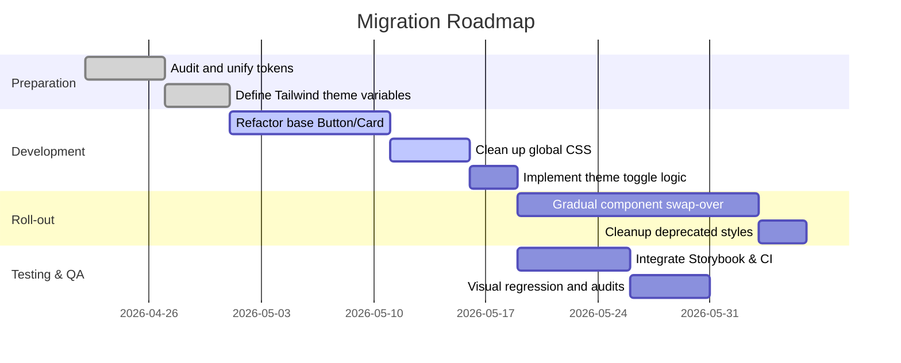

# Executive Summary

The Novellum front end is a SvelteKit (Svelte 5, Runes) application styled with Tailwind CSS and custom CSS. Its UI is built with a mix of component libraries (e.g. bits-ui/shadcn-svelte), handcrafted components, and CSS variables for design tokens. This has led to multiple styling approaches coexisting: raw CSS (in `src/styles/*.css` and component `<style>` blocks), Tailwind utility classes, and a legacy “components.css” with custom classes (e.g. `.btn-primary`). We find duplicated definitions and inconsistent token usage: e.g., colors and spacing are defined both in `src/styles/tokens.css` (CSS variables) and via Tailwind config (`tailwind.config.js` uses CSS vars for colors)【61†L8-L18】【64†L50-L58】.  

A comprehensive refactor is needed. We propose unifying on Tailwind’s theming and a single token system. All colors, typography, spacing, etc., should be declared once as *design tokens* (using Tailwind’s `@theme` variables or imported CSS vars) and consumed via utility classes or token references【101†L268-L277】【64†L50-L58】. We will restructure the UI library with clear primitives (Button, Card, Panel, etc.), establish naming conventions (e.g. BEM or component-based), and implement a theming layer (light/dark via class toggling). This report inventories the current stack and components, highlights inconsistencies with examples, and lays out a step-by-step migration plan with code samples, testing guidelines, tooling, and risk mitigation. 

## 1. Frontend Inventory

- **Frameworks & Tools:** SvelteKit 2 (Svelte 5, Runes) with Vite, TypeScript, Dexie/SQLite (for data store). Tailwind CSS (v3.4.17) is used via PostCSS. Additional libs include `bits-ui` (headless Svelte components), `tailwind-variants` (for responsive class variants), `clsx`, Lucide Svelte (icons), Tiptap (rich text), Zod, ESLint, Vitest, Playwright, etc. CI likely uses GitHub Actions (unspecified).  

- **File Structure:** Key paths include:

  - `src/app.css` – global CSS entry, imports resets, tokens, components, Tailwind (via `@tailwind base/components/utilities`)【68†L0-L8】.
  - `src/styles/` – custom CSS: 
    - `tokens.css` (design tokens, e.g. colors, spacing, typography)【64†L50-L58】, 
    - `components.css` (global classes like `.btn-primary`, `.input`, `.surface-*`, etc.)【69†L27-L35】【69†L76-L84】,
    - `bible-entities.css`, `bible.css` (domain-specific styles),
    - `shadcn.css` (Tailwind base layers and color variables)【61†L6-L14】.
  - `svelte.config.js` – configures aliases (`$lib`, `$modules`) and preprocessors.
  - `tailwind.config.js` – configures Tailwind to use HSL CSS variables for colors and other theme extensions【7†L1-L9】.
  - **Components:** 
    - `src/lib/components/ui/` – reusable UI primitives (buttons, cards, inputs, nav, etc.). E.g. `PrimaryButton.svelte`, `SecondaryButton.svelte`, `Button.svelte`, `Card.svelte`, `Input.svelte`, `PillNav.svelte`, etc. (exported in `src/lib/components/ui/index.ts`【46†L0-L8】). 
    - `src/lib/components/` – other common components (e.g. `AppHeader.svelte`, `OnboardingModal.svelte`)【41†L0-L7】【72†L0-L9】.
    - `src/modules/.../components/` – feature-specific components/forms (ProjectCard, forms in Outliner, Bible, Settings modules, etc). Notably, many components here embed styling themselves or use utility classes.
  - **Routes:** `src/routes/` holds pages and layouts (`+page.svelte`, `+layout.svelte`) which use the components above. Many of these mix Tailwind classes (e.g. `<div class="grid ...">`) with custom classes (e.g. `.hero`, `.app-header` as defined in components).

- **Build/Dev Tools:** Uses Vite (via SvelteKit), PostCSS (Tailwind), ESLint, Prettier, Vitest (tests), Playwright (e2e), `pnpm` for package management. Tailwind color mode is class-based (as set in config to `darkMode: ['class', ...]`【103†L117-L125】).  

**Key Dependencies (excerpt from package.json):** SvelteKit, `@sveltejs/adapter-node`, `tailwindcss`, `tailwind-variants`, `clsx`, `@lucide/svelte`, `bits-ui`, `tiptap-*`, `zod`, etc【16†L4-L13】.  

## 2. Component Map

Below is a representative set of UI components in Novellum, their locations, major props, and where they are used:

| Component              | File Path                                        | Props / Inputs                 | Usage                                                      |
|------------------------|--------------------------------------------------|-------------------------------|------------------------------------------------------------|
| **Button** (base)      | `src/lib/components/ui/button/button.svelte`     | `variant`, `size`, `class` + HTML props (type, href, etc)【29†L1-L10】 | Internal: base for all buttons. Used by Primary/Secondary/Ghost/Destructive buttons. |
| **PrimaryButton**      | `src/lib/components/ui/PrimaryButton.svelte`     | (children, `class`, other)【82†L6-L10】 (wraps Button variant=default) | Used in modals, forms (e.g. OnboardingModal, project forms), to show primary actions. |
| **SecondaryButton**    | `src/lib/components/ui/SecondaryButton.svelte`   | (children, `class`, other)【83†L6-L10】 (variant=secondary)    | Used for secondary actions (e.g. cancel, back). |
| **GhostButton**        | `src/lib/components/ui/GhostButton.svelte`       | (children, `class`, other)【81†L6-L11】 (variant=ghost)        | Used for neutral/less-prominent actions (e.g. icon buttons with transparent background). |
| **DestructiveButton**  | `src/lib/components/ui/DestructiveButton.svelte` | (children, `class`, other)【84†L6-L10】 (variant=destructive)  | Used for delete/danger actions (e.g. “Delete” confirmations). |
| **Input**              | `src/lib/components/ui/Input.svelte`             | Likely `value`, `type`, `placeholder`, etc. (wrapper for `<input>`) | Used in forms throughout the app (project forms, settings, etc.). |
| **PillNav**            | `src/lib/components/ui/PillNav.svelte`           | `items` (array of `{id,label}`), `activeId`, `onSelect`, `ariaLabel` | Used in `AppHeader.svelte` for project navigation (world-building sections, chapter/scene nav)【72†L147-L155】. |
| **SectionHeader**      | `src/lib/components/SectionHeader.svelte`        | (e.g. `leftContent`, `rightContent` or slots) | Likely used in pages to display section titles or tabs (e.g. project pages). |
| **EmptyStatePanel**    | `src/lib/components/EmptyStatePanel.svelte`      | Probably children/content slot      | Used when lists are empty (e.g. no projects, no stories) to show placeholder. |
| **SurfaceCard**        | `src/lib/components/ui/SurfaceCard.svelte`       | (children, optional props)       | A styled container (card) used in lists (e.g. project lists, note previews). |
| **SurfacePanel**       | `src/lib/components/ui/SurfacePanel.svelte`      | (children, header slot?)         | A panel container (often used to group content in sidebar or overlay). |
| **AppHeader**          | `src/lib/components/AppHeader.svelte`            | None (derives context from `$page` and stores) | The top application header (shows title, Nav toggles, settings icon)【72†L131-L139】【74†L242-L251】. |
| **OnboardingModal**    | `src/lib/components/OnboardingModal.svelte`      | None externally (manages its own `open`)【41†L0-L7】 | Shown once on first launch; welcomes user and highlights features【41†L85-L94】. |
| **Hero** (sample)      | *Not currently present; example only*            | --                              | *A potential top-page banner component (suggested sample).* |

*Usage notes:* Pages (`src/routes/...`) import and compose these components. For example, the project listing page uses `SurfaceCard` and `PrimaryButton`; the writing editor page uses `PillNav`; the Onboarding page uses `OnboardingModal`. Each component’s props should be documented (Typescript in code or a design spec) for clarity.

## 3. Stylesheet and Token Map

Novellum’s styles span multiple systems:

- **Tailwind CSS (utility classes):** Configured in `tailwind.config.js`【7†L1-L9】. Content paths include `src/**/*`. The config uses CSS variables for colors (e.g. `primary: 'hsl(var(--primary))'` etc)【7†L1-L9】, linking Tailwind utilities (`bg-primary`, `text-primary-foreground`) to CSS variables. Tailwind also provides the spacing, typography, and other utilities. 

- **Design Tokens (CSS variables):** Defined in `src/styles/tokens.css`. This file sets most visual constants: color palettes (`--color-surface-*`, `--color-text-*`, `--color-border-*`, `--color-nova-blue`, etc) and atomic tokens for spacing (`--space-1`, `--space-2`, … `--space-16`), typography sizes (`--text-sm`, `--text-base`, etc), font families, line-heights, shadows, and motion timings【64†L50-L58】【65†L134-L142】. For example, `--space-4: 16px;` and `--text-3xl: 1.875rem;`【64†L52-L54】【64†L72-L75】. These tokens are globally loaded (via `app.css`) so that both CSS and components can use `var(--space-4)` etc. Light/dark themes are handled by the presence of a `.dark` class (see `shadcn.css` which overrides a palette when `.dark` is set)【61†L8-L17】【61†L38-L47】.

- **Global CSS Classes:** In `src/styles/components.css`, there are legacy utility classes (e.g. `.form-panel`, `.input`, `.btn-primary`, `.btn-ghost`, etc) that apply tokens【69†L27-L35】【69†L76-L84】. For instance, `.btn-primary` sets `background: var(--color-nova-blue); color: var(--color-text-on-dark)`【69†L76-L84】, parallel to what the Tailwind-based `PrimaryButton` does. There are surface layering classes `.surface-1`…`.surface-4`, motion helpers (`.motion-fade`, `.motion-lift`), and other utilities. These appear intended for non-Tailwind markup or legacy use.

- **Component-scoped CSS:** Many Svelte components include their own `<style>` blocks (scoped). E.g. `AppHeader.svelte` styles `.app-header`, `.header-action`, etc using CSS vars【74†L242-L251】【74†L315-L324】. `OnboardingModal.svelte` defines its backdrop and modal animation styles inline【41†L115-L124】. These mix token usage (`var(--space-4)`, `var(--color-border-subtle)`, etc) with custom animations. Some Svelte components may also use Tailwind classes directly in markup (e.g. lots of `class="flex ..."` in pages and components built with Tailwind).

- **Tailwind-Variants:** The UI Button component uses the `tailwind-variants` library to generate variant classes in JS (see `Button` component code)【29†L1-L10】. This defines an internal tailwind-based style object (`buttonVariants`) keyed by `size` and `variant`, outputting Tailwind class strings. This is a hybrid approach: Tailwind utilities generated in JS rather than static classes in markup.

**Token Usage:** The global tokens in `tokens.css` are widely used (see components.css and inline styles). Tailwind classes indirectly use them via CSS vars (e.g. `text-primary-text` corresponds to `var(--color-text-primary)`). However, notice duplication: e.g. `--color-primary` (in `shadcn.css`) vs `--color-nova-blue` (in tokens.css) are two separate primary colors. Indeed, `shadcn.css` defines CSS vars for a “primary” palette【61†L8-L17】 that appear unused by the app, since most code uses `--color-nova-blue` from tokens.css. Similarly, spacing uses tokens (`--space-*`) instead of Tailwind’s built-in (`p-4`, etc) in many places.

## 4. Inconsistencies & Anti-Patterns

We observe several style inconsistencies:

- **Multiple Button Systems:** The code defines buttons in *three* ways: (a) the Tailwind-Variants `Button` component with `variant` prop (in `ui/button`), (b) wrapper components (`PrimaryButton`, etc) that use the TV `Button`, and (c) old CSS classes (`.btn-primary`, `.btn-ghost`, `.btn-danger` in `components.css`)【69†L76-L84】【69†L103-L111】. It’s unclear if `.btn-*` classes are still in use; e.g. modern code typically uses `<PrimaryButton>` instead. This duplication is confusing. For example, the `.btn-primary` class in CSS sets padding and background【69†L76-L84】, but the Tailwind button variant does similar via Tailwind classes【29†L2-L10】. Having both encourages drift.

- **Mixed Theming Approaches:** Colors are sometimes taken from `tokens.css` (`--color-nova-blue`, `--color-text-primary`, etc【64†L25-L33】), and sometimes from `shadcn.css` variables (e.g. `--primary`, `--accent`)【61†L8-L17】. It’s unclear which palette is authoritative. In practice, token names like `--color-nova-blue` are used in CSS, while Tailwind classes refer to `--primary`. This mismatch can cause confusion and errors (e.g. “why does my Tailwind `bg-primary` not match my CSS `--color-nova-blue`?”).

- **Inline CSS vs Utilities:** Some components use raw `<style>` with tokens (e.g. OnboardingModal)【41†L115-L124】, while others rely on Tailwind classes (e.g. pages with `class="grid gap-4 p-6"`). For instance, `OnboardingModal.svelte` scrolls and positions via CSS, but could instead use Tailwind’s `fixed inset-0 flex` etc. This inconsistency makes styles harder to track. Also, tokens like `--space-4` show up in CSS, but developers often write `p-4` in markup (which uses Tailwind’s 1rem). Indeed, OnboardingModal uses `padding: var(--space-4)` (16px)【41†L115-L124】 whereas a Tailwind equivalent would be `p-4`. Mixing these means two grids exist (Tailwind’s default and the custom tokens), risking spacing mismatches.

- **Unused or Overlapping Rules:** Many CSS rules in `components.css` appear unused or redundant given Tailwind. For example, `.input` in CSS duplicates what a Tailwind `<input class="bg-surface-overlay ..." />` would do. The presence of both suggests an anti-pattern (mixing global CSS with utility CSS).  

- **Naming and Semantics:** Some classes use BEM-like names (`.header-action--new`) while others are flat (`.btn-primary`). Component naming (PascalCase) is mixed with utility classes (kebab-case). Establishing one convention (e.g. CSS modules or BEM) and sticking to it would help.

**Problematic Code Snippets:**

*Example – Mixed styles in OnboardingModal:*  
```html
<div class="modal-content" ...>
  ...
</div>
<style>
  .modal-content {
    background: var(--color-surface-base);
    border: 1px solid var(--color-border-subtle);
    border-radius: var(--radius-lg);
    /* animation, overflow, etc. */
  }
  ...
</style>
```  
Here, `OnboardingModal.svelte` uses a scoped class with token variables for styling【41†L131-L139】. But the global `SectionHeader` or other panels use Tailwind classes or the `.surface-` utilities. The modal could instead leverage shared components (e.g. a `<Dialog>` component) to avoid duplicating styles.

*Example – Duplicate button styling:*  
```css
/* in components.css */
.btn-primary {
  background-color: var(--color-nova-blue);
  color: var(--color-text-on-dark);
  padding: var(--space-2) var(--space-4);
  /* ... */
}
```
```svelte
<!-- in Button.svelte (Tailwind) -->
<button class={cn(buttonVariants({ variant }))}>
  {children}
</button>
```
The CSS `.btn-primary`【69†L76-L84】 and the Tailwind variant (in `button.svelte`) both define blue background and padding, but via different means. This is duplication and can lead to drift if one is updated but not the other.

## 5. Proposed Refactor

### Unified Design Tokens

- **Single Source of Truth:** Consolidate all tokens into one system. We propose **migrating tokens to Tailwind’s theme variables** with the `@theme` directive【101†L268-L277】. For example, define `--color-nova-blue` as a theme color token so that Tailwind generates utilities (`bg-nova-blue`). Or simply rename Tailwind’s `--primary` token to `--nova-blue` to match CSS. Ensure the `tokens.css` palette is ported into `tailwind.config.js` under `theme.extend.colors` (using CSS variables if needed). This way, e.g.:

  ```css
  /* In a global CSS (e.g. tailwind.css) */
  @tailwind base;
  @tailwind components;
  @tailwind utilities;
  @theme {
    --color-nova-blue: 59 130 246; /* HSL or RGB values */
    /* ... other tokens ... */
  }
  ```
  Tailwind will then allow `bg-nova-blue` in markup, and CSS vars can still be used for non-utility values【101†L297-L304】.

- **CSS Variables:** For fine-grained values (animation durations, custom radii, etc.), keep them in CSS (as currently) but reference them in Tailwind theme if possible. For example, Tailwind’s `borderRadius` could use `--radius-md` from `tokens.css`. This ensures consistency.

- **Naming Conventions:** Adopt clear token names. E.g. prefer semantic color names (`--color-primary`, `--color-secondary`) or domain names (`--color-nova-blue` vs `--color-accent`). Avoid duplicate concepts (remove one of “primary” vs “nova-blue”). Align Tailwind’s color naming with our CSS variables.

### Component Library Structure

- **Base Components:** Define a small set of primitive components (Button, Card, Input, etc.) in `src/lib/components/ui`. Each should have unambiguous props (e.g. `<Button variant="primary" size="md">`). Use **slots** or children for content. These components should render HTML with **consistent Tailwind class usage** referencing the theme. For example, a base Button might be:

  ```svelte
  <!-- src/lib/components/ui/Button.svelte -->
  <script>
    export let variant = 'default';
    export let size = 'md';
    export let class = '';
  </script>
  <button
    class={cn(
      variant === 'default' ? 'bg-nova-blue hover:bg-nova-blue-600 text-white' : '...',
      size === 'md' ? 'px-4 py-2 text-sm' : '',
      class
    )}
    {...$$restProps}
  >
    <slot/>
  </button>
  ```
  (Using `cn()` for merging classes.) We already have a working `Button` (with `tailwind-variants`) – we would clean it up to directly map to Tailwind utilities reflecting our theme tokens.

- **Derived Components:** Continue to use wrapper components for convenience, but they should remain thin. E.g., `<PrimaryButton>` still wraps `<Button variant="default">`. Remove redundant wrappers (e.g. `<Button>` itself could be primary by default). 

- **Naming Conventions:** Component names should be PascalCase. CSS classnames (if used) should follow BEM or utility-first convention. We recommend **utility-first** where possible: minimize custom class names. Components that need custom styling can use a fixed class (e.g. `class="app-header"`) but avoid one-off IDs or inline styles.

- **Theming (Light/Dark):** Use Tailwind’s `dark` variant. E.g. in `tailwind.config.js`:  
  ```js
  darkMode: ['class', '[data-theme="dark"]']
  ``` 
  Then all `bg-primary/ dark:bg-primary-dark` will work. A Svelte store or `<html class="dark">` toggle can control the theme.

- **Dynamic Accents:** For “dynamic cover-based accents” (e.g. selecting a theme color from content), define a CSS variable `--accent-color` on some parent (e.g. `<body style="--accent-color: <color>">`). Then Tailwind can use `var(--accent-color)` in a custom utility or the components can reference it via `style="color: var(--accent-color)"`.

### Example Theme Provider (Svelte)

```svelte
<!-- src/lib/theme/ThemeProvider.svelte -->
<script>
  import { onMount } from 'svelte';
  export let theme = 'light'; // or 'dark'
  onMount(() => {
    document.documentElement.setAttribute('data-theme', theme);
  });
</script>
<slot/>
```
Place this at the app root or wrap layouts to apply themes via the `data-theme` attribute (as Tailwind’s config allows).  

## 6. Migration Roadmap

To transition safely, we recommend these steps (each can be toggled via feature flags or done in branches):

| Step                                    | Description                                                             | Effort | Risk/Notes |
|-----------------------------------------|-------------------------------------------------------------------------|:------:|------------|
| **Token Consolidation**                 | Audit all color/spacing/font variables. Merge duplicates (`--primary` vs `--nova-blue`). Move definitions into Tailwind theme tokens (via `@theme` or `tailwind.config.js`)【101†L268-L277】. | Small  | Low: Straightforward refactoring of globals. |
| **Clean Global CSS**                    | Prune unused rules in `components.css` (especially button classes if unused) and module CSS. Rename or remove overlapping classes. | Medium | Low-medium: mostly deletions. Ensure nothing breaks. |
| **Base Component Refactoring**          | Update `Button`, `Card`, `Input`, etc. to use unified tokens and Tailwind classes. For example, make `<Button variant="primary">` use `bg-nova-blue` and remove any hard-coded colors. | Medium | Medium: affects many UIs. Test each variant thoroughly. |
| **Theme Implementation**                | Implement light/dark mode globally. Add a Svelte store or context, and apply `dark` class or `data-theme` on `<html>`. Convert existing components’ color references to use Tailwind’s dark variants (e.g. `dark:bg-surface-elevated`). | Small | Low: Adds structure but few UI changes if done right. |
| **Component Library Clean-up**          | Remove old wrappers or CSS where replaced by new base components. E.g. deprecate `.btn-primary` class and replace its usage with `<PrimaryButton>`. Switch page code to use new component props and classes. | Large | High: wide-ranging changes. Do incrementally per module/page. |
| **Incremental Swap**                    | For each module/page, replace legacy markup or class usage with new components. E.g. swap `<a class="btn-primary">` to `<PrimaryButton>`, or replace custom grid with Tailwind classes. Use codemods if many. | Large | High: risk of UI break. Deploy behind feature flags or in small batches. |
| **Testing & Cleanup**                   | As refactoring proceeds, run visual regression and accessibility tests (see next section) to catch discrepancies. Remove now-unused CSS variables, confirm tokens. | Medium | Low: ensures quality. |
| **CI Integration**                      | Configure linters (Stylelint with Tailwind plugin), Storybook for UI testing, and automated visual diff (e.g. Chromatic). Update CI scripts to run these. | Medium | Low: mostly tooling. |



## 7. Sample Refactor Code

To illustrate the approach, here are sketches of key refactored pieces:

**Design Tokens (Tailwind theme, in `tailwind.config.js`):** We import our tokens or define them in `@theme`. For example:

```js
// tailwind.config.js (excerpt)
module.exports = {
  darkMode: ['class', '[data-theme="dark"]'],
  theme: {
    extend: {
      colors: {
        primary: 'rgb(var(--color-nova-blue))',
        surface: 'rgb(var(--color-surface-base))',
        // ... import other tokens ...
      },
      spacing: {
        4: 'var(--space-4)',
        6: 'var(--space-6)',
        // ... or use default 1=4px grid ...
      },
      fontSize: {
        '3xl': 'var(--text-3xl)',
        // ...
      },
      // etc.
    }
  },
  plugins: [],
}
```

**Button Component (base):**

```svelte
<!-- src/lib/components/ui/Button.svelte -->
<script>
  export let variant = 'primary';  // default, primary, ghost, destructive, etc.
  export let size = 'md';          // e.g. sm, md, lg
  export let class: className = '';
  // collect remaining attributes
  let rest = $$restProps;
</script>

<button
  class={cn(
    variant === 'primary' ? 'bg-primary hover:bg-primary-dark text-white' : '',
    variant === 'secondary' ? 'border border-primary text-primary hover:bg-primary-light' : '',
    variant === 'destructive' ? 'bg-red-600 hover:bg-red-700 text-white' : '',
    size === 'sm' ? 'px-3 py-1 text-sm' : 'px-4 py-2 text-base',
    className
  )}
  {...rest}
>
  <slot/>
</button>
```

**Card Component:**

```svelte
<!-- src/lib/components/ui/Card.svelte -->
<script>
  export let class: className = '';
</script>
<div class={`bg-surface-raised border border-border-default rounded-lg p-4 ${className}`}>
  <slot/>
</div>
```

**Theme Provider (Svelte Context):** We can simply toggle a `dark` class on the root element when the user switches themes:

```svelte
<!-- In +layout.svelte or a root component -->
<script>
  import { onMount } from 'svelte';
  import { theme } from '$lib/stores/theme.js'; // a writable store with 'light'/'dark'
  $: {
    if ($theme === 'dark') document.documentElement.classList.add('dark');
    else document.documentElement.classList.remove('dark');
  }
</script>
<slot/>
```

(Styles like `dark:text-white` will now apply based on the `.dark` class.)

## 8. Testing & QA Checklist

- **Visual Regression:** Use a visual testing tool (Chromatic, Percy, or Playwright snapshot) to capture key pages/ components before and after changes. For example, render the OnboardingModal, AppHeader, and a few pages, and compare diffs to detect unintended style shifts.
- **Accessibility:** Run Axe or Lighthouse on pages (especially forms and modals) to catch color contrast or focus issues. Ensure keyboard navigation works for modals/dialogs (as OnboardingModal did with focus trapping) and that new components have proper `aria` labels.
- **Performance:** Check CSS bundle size (Tailwind should purge unused styles) and page speed (Tailwind JIT aids this). Ensure no significant layout shifts when toggling themes (e.g. include `prefers-color-scheme` or `class` stable to avoid flicker).
- **Unit/Visual Tests for Components:** Add Storybook stories for each new component (Button, Card, Input, etc.) and use Storybook’s screenshot testing (via Chromatic or Playwright) to lock in styles.  
- **Cross-browser/CSS Checks:** Verify that custom CSS variables (`color-mix`, etc. used in header) have fallbacks or check compatibility. Test on common browsers.

## 9. Recommended Tooling

- **Storybook:** Integrate Storybook with SvelteKit for component-driven development. Use [Storybook’s Tailwind recipe](https://storybook.js.org/recipes/tailwindcss)【103†L73-L82】 to include the `tailwind.css` build in stories, and add the `@storybook/addon-themes` for light/dark toggling【103†L129-L137】. This allows isolating UI components during the refactor.
- **Stylelint:** Lint styles with Stylelint, using `stylelint-plugin-tailwindcss` or the official [`stylelint-config-tailwindcss`](https://www.npmjs.com/package/stylelint-config-tailwindcss) so that Tailwind classes are recognized. Stylelint rules can enforce token usage (e.g. disallow raw colors in CSS)【106†L37-L44】.
- **ESLint:** Ensure ESLint (with a Svelte plugin) checks for unused CSS classes or props. Use `eslint-plugin-svelte3` or newer SvelteKit linting configs.
- **Design Token Tools:** Consider a JSON/YAML source for tokens (e.g. Style Dictionary) if tokens will be shared outside CSS (Figma, Android, etc.). This is optional given the current CSS-based approach.
- **Visual Regression Tools:** Chrome-based tools like [Chromatic](https://www.chromatic.com/) or [Playwright’s snapshot tests] can automatically catch UI drift on each commit.
- **CI Integration:** In CI, run `npm run lint`, `npm run test`, and perform headless Storybook or cypress tests. For example, include a script to build Storybook and compare screenshots. See [Storybook CI guides](https://storybook.js.org/blog/continuous-deployment-for-storybook/). Ensure Tailwind’s `npm run build` is done so the latest styles are generated.

**CI Example:**  

```yaml
# GitHub Actions snippet
jobs:
  test:
    runs-on: ubuntu-latest
    steps:
      - uses: actions/checkout@v4
      - run: npm ci
      - run: npm run lint       # ESLint/Stylelint
      - run: npm run test       # Vitest
      - run: npm run build      # build Tailwind/CSS
      - run: npm run test:visual  # e.g. run Storybook snapshot tests
```

## 10. Risks and Mitigation

- **UI Breakage:** Large-scale style changes can unintentionally alter layouts. *Mitigation:* Migrate gradually (feature-flag parts), with visual regression testing at each step. Also, keep backups of old CSS classes until fully replaced.
- **Theme Drift:** If token names change, some components might still reference old CSS vars. *Mitigation:* During refactor, update references across all code (a codemod can help). Write transitional CSS (e.g. map `--color-primary` → `--color-nova-blue`).
- **Inconsistent Conversion:** Parts of the app may lag behind (mixed styling remains). *Mitigation:* Define clear progress milestones (component by component) and code ownership. Use Storybook stories as a contract.
- **Tooling Complexity:** Introducing Storybook, Stylelint, etc. adds overhead. *Mitigation:* Keep initial configs minimal. Use community presets (e.g. Storybook’s Tailwind addon) to reduce setup time【103†L38-L47】【106†L39-L47】.
- **Performance Overhead:** A very large CSS file of tokens and unused utilities could bloat CSS. *Mitigation:* Tailwind’s purge will strip unused classes. After refactor, remove unused tokens and CSS to slim down.

By following a disciplined, incremental approach – grounded in a unified token system and shared component library – Novellum can achieve consistent styling, easier theming, and a more maintainable codebase. The refactor will enable faster feature development (by reusing components) and a polished user experience. 

**Sources:** We referenced Novellum’s own code (e.g. components and style files【41†L115-L124】【64†L50-L58】) to identify current patterns, and best-practice documentation (Tailwind theming guide【101†L268-L277】【101†L297-L304】, Storybook with Tailwind【103†L73-L82】【103†L129-L137】, Stylelint features【106†L37-L44】) to inform the proposed solutions.